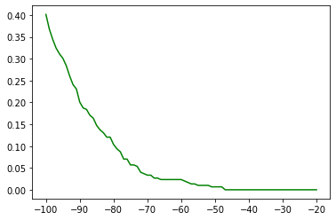

# Techcore Experience

---

```python
import time
import base64
import numpy as np
import requests as req
from pathlib import Path
import matplotlib.pyplot as plt
```

### Checking connection status from frAPI


```python
resp = req.get('http://35.237.84.73/frapi/status')
print(resp)
```

    <Response [200]>
    

---
##  Defining functions


```python
def get_base64(image_path):
    with open(image_path, 'rb') as img_file:
        return base64.b64encode(img_file.read()).decode('utf-8')
```


```python
def get_image_num(id):
    num = int(id)
    if num < 10:
        return f'000{num}'
    elif num < 100:
        return f'00{num}'
    else:
        return num
```


```python
def get_img_name(name, id):
    return f'{name}_{get_image_num(id)}.jpg'
```


```python
def get_img_paths(pair):
    matched = len(pair) == 3
    
    first_name = get_img_name(pair[0], pair[1])
    second_name = get_img_name(pair[0], pair[2]) if matched else get_img_name(pair[2], pair[3])
    
    first_path = Path(Path('dataset'), pair[0], first_name)
    second_path = Path(Path('dataset'), pair[0] if matched else pair[2], second_name)
    
    return first_path, second_path
```


```python
def get_similarity_scores(arr):
    drop_count = 0
    scores = []
    
    print('Loading...')
    
    for pair in arr:
        first_path, second_path = get_img_paths(pair)

        req_body = {
            'image_b641': get_base64(first_path),
            'image_b642': get_base64(second_path),
        }

        resp = req.post('http://35.237.84.73/frapi/verify/images', json = req_body)
        if resp.status_code == 200:
            scores.append(resp.json()['similarity_score'])
        else:
            drop_count += 1
    
    print(f'Drops: {drop_count}')
    print('Done...')
    return scores
```


```python
def array_file(arr, fname):
    file = open(f'{fname}.txt', 'w')
    np.savetxt(file, arr)
    file.close()
```


```python
def min_max(arr):
    min = arr[0]
    max = arr[0]

    for num in arr:
        if num < min:
            min = num
        elif num > max:
            max = num;
    return min, max
```


```python
def normalize(arr):
    min, max = min_max(arr)

    res = []
    for num in arr:
        res.append((num - min) / (max - min))

    return res
```

## Testing api 

### Loading arrays


```python
matched_pairs = np.loadtxt(Path('matched_pairs.txt'), dtype='str')
mismatched_pairs = np.loadtxt(Path('mismatched_pairs.txt'), dtype='str')
```

It takes around 5min to complete all 300 requests and populate each array


```python
start = time.time()
matched_pairs_scores = get_similarity_scores(matched_pairs)
elapsed = time.time() - start

print(f'Elapsed time: {int(elapsed)}s')
print('Score array length: ', len(matched_pairs_scores))
```

    Loading...
    Drops: 0
    Done...
    Elapsed time: 275s
    Score array length:  300
    


```python
start = time.time()
mismatched_pairs_scores = get_similarity_scores(mismatched_pairs)
elapsed = time.time() - start

print(f'Elapsed time: {int(elapsed)}s')
print('Score array length: ', len(matched_pairs_scores))
```

    Loading...
    Drops: 1
    Done...
    Elapsed time: 273s
    Score array length:  300
    

### Saving arrays into files
so it's not necessary to make the same request everytime


```python
array_file(matched_pairs_scores, 'matched_scores')
array_file(mismatched_pairs_scores, 'mismatched_scores')
```

### Loading array from files


```python
matched_scores_arr = np.loadtxt('matched_scores.txt')
mismatched_scores_arr = np.loadtxt('mismatched_scores.txt')
```

### False Rejection Rate (FRR)


```python
x_frr = []
y_frr = []

cp = len(matched_scores_arr) 

for x in range(20, 101):
    fn = 0
    for score in matched_scores_arr:
        if score < x:
            fn += 1

    tp = cp - fn
    fnr = fn / cp

    frr = fnr * fn / (tp + fn)
    x_frr.append(x)
    y_frr.append(frr)
```


```python
plt.plot(x_frr, y_frr, 'r')
```


    [<matplotlib.lines.Line2D at 0x19451512df0>]


    

    


### False Acceptance Rate (FAR)


```python
x_far = []
y_far = []

cn = len(mismatched_scores_arr)

for x in range(-100, -19):
    fp = 0
    for score in mismatched_scores_arr:
        if score > x:
            fp += 1
    fpr = fp / cn
    x_far.append(x)
    y_far.append(fpr)
```


```python
plt.plot(x_far, y_far, 'g')
```


    [<matplotlib.lines.Line2D at 0x194535f2190>]


    

    


### FRR x FAR 


```python
plt.plot(normalize(x_frr), normalize(y_frr), 'r', normalize(x_far), normalize(y_far), 'g')
```


    [<matplotlib.lines.Line2D at 0x19453663070>,
     <matplotlib.lines.Line2D at 0x194536630a0>]


    

    

